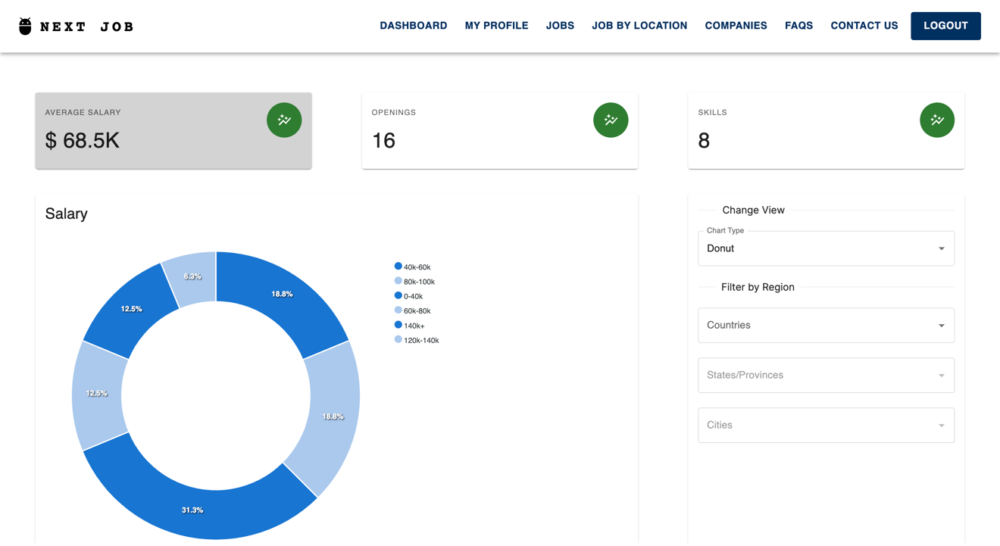
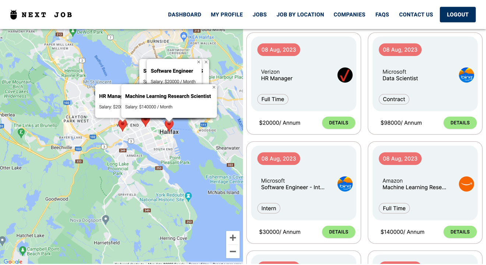

# 

# NextJob

<table>
<tr>
<td>

This is a group submission to meet the requirements of D3. As a team of 6, we have developed an innovative job search web application called “Next Job” which aims to revolutionize the recruitment landscape by addressing the prevalent challenges in job seeking and job hiring process. It can be claimed as a one-stop solution for job seekers and employers with a goal to bridge the gap between them through user-centric interface and experience. This submission has the complete end to end feature implementation of our project prototype. In this submission data is not hardcoded and is being retrieved by calling the APIs that we have developed.

From our application’s user personas, we have collected and addressed a few frustrations.
The complexities in the process of using the application are addressed by our simple and minimalistic user interface and by implementing automated capabilities wherever possible. We have provided better user experience by eliminating time consumption problems through filters and visual analytics dashboard.

With respect to process, we have followed design thinking strategy where we started from empathize phase followed by define phase, then ideate phase, prototype phase and then finally the testing phase. With respect to tech-stack, we have used next.js for a uniform and sleek user experience, constructed RESTful APIs using Gin Web framework written in Golang for our middleware and we used MongoDB to store data in a schema less structure.

</td>
</tr>
</table>

## Site

### Landing Page

### Job Seeker Onboarding Page

### Job Seeker Dashboard

## Job Seeker Dashboard - Job Search

## View Companies

## Jobs By Location

## Job Details

## Employer Create Job Posting

## Employer Email Notification Service

## Employer Dashboard

## List of Features Developed

- _Job Application Process:_ This feature is designed for job seekers to view the list of jobs, filter them based on their preferences, and then apply for the desired job.
- _Employer notification:_ The employer notification feature ensures that the employer gets notified through email, whenever a seeker submits.
- _Location-based job search:_ The location-based job search feature enables users to input their desired radius and filters job listings accordingly, displaying relevant opportunities within the specified area.
- _Insights Dashboard:_ This feature has widgets and chart components that provide visual insights based on different aspects like Average Salary, Skill Demand and location-based Job openings.
- _Onboarding and profile management:_ This feature enables both job seekers and employers to enroll themselves as registered users of the application and let them manage their profiles.
- _Customized applicant filter:_ The customized applicant filter tailors and refines the applicant search criteria based on specific requirements, allowing employers to efficiently shortlist and identify qualified candidates.
- _Job posting management:_ Employers can effectively create, edit, and manage job postings within the system, ensuring accurate and up-to-date job listings.
- _Company review management:_ Enables recently joined employees to post and update reviews on a listed company, fostering transparency and engagement with the company’s reputation.
- _Company overview and active job openings:_ This feature is completely developed. Through this feature, user will be able to browse details about the desired company in the "description" tab. View reviews about the company in the "Reviews" tab, and then view job openings in the "Active Job Openings" tab.

- _Customized Companies Listing:_ This feature is partially developed. Through this feature, user will be able to view all the companies that have been partnered with our next job platform. It also has customized filter which are partially implemented. These filters help users to filter companies based on their requirements.

- _Candidate details:_ This feature is for the employers to view comprehensive details about candidates who have applied for job positions, including their qualifications, experience, and contact information, aiding in the evaluation and selection process.

### Tools & Technologies Used

- [![Next][Next.js]][Next-url]
- [![Golang][Golang]][Golang-url]
- [![Gin][Gin]][Gin-url]
- [![MongoDB][MongoDB]][MongoDB-url]
- [![Material-UI][MaterialUI]][MaterialUI-url]
- [![Formik][Formik]][Formik-url]
- [![Google Maps][GoogleMaps]][GoogleMaps-url]
- [![Google Places API][GooglePlacesAPI]][GooglePlacesAPI-url]

## Team

- [Aayush Dakwala](ay383119@dal.ca) - _(Developer)_
- [Jeet Mehta](jt429386@dal.ca) - _(Developer)_
- [Kruti Panchal](lk544219@dal.ca) - _(Developer)_
- [Lokeshwar Kumar Tabjula](lk544219@dal.ca) - _(Developer)_
- [Maulik Gajipara](ml477880@dal.ca) - _(Developer)_
- [Kishan Patel](kpatel@dal.ca) - _(Developer)_

## Code Integration Instructions

### Backend

- Clone the repository using the following command: `git clone https://github.com/Jeet989/NextJob.git`
- Navigate to the backend folder using the following command: `cd backend/`
- Install the dependencies using the following command: `go mod download`
- Run the server using the following command: `go run main.go`

### Frontend

- Clone the repository using the following command: `git clone https://github.com/Jeet989/NextJob.git`
- Navigate to the frontend folder using the following command: `cd frontend/`
- Install the dependencies using the following command: `npm install`
- Run the server using the following command: `npm run dev`

[Next.js]: https://img.shields.io/badge/Next.js-000000?style=for-the-badge&logo=Next.js&logoColor=white
[Next-url]: https://nextjs.org/
[Golang]: https://img.shields.io/badge/Go-00ADD8?style=for-the-badge&logo=go&logoColor=white
[Golang-url]: https://golang.org/
[MongoDB]: https://img.shields.io/badge/MongoDB-4EA94B?style=for-the-badge&logo=mongodb&logoColor=white
[MongoDB-url]: https://www.mongodb.com/
[MaterialUI]: https://img.shields.io/badge/Material--UI-0081CB?style=for-the-badge&logo=material-ui&logoColor=white
[MaterialUI-url]: https://material-ui.com/
[Formik]: https://img.shields.io/badge/Formik-663399?style=for-the-badge&logo=formik&logoColor=white
[Formik-url]: https://formik.org/
[GoogleMaps]: https://img.shields.io/badge/Google%20Maps-4285F4?style=for-the-badge&logo=google-maps&logoColor=white
[GoogleMaps-url]: https://cloud.google.com/maps-platform
[Gin]: https://img.shields.io/badge/Gin-000000?style=for-the-badge&logo=go&logoColor=white
[Gin-url]: https://gin-gonic.com/
[GooglePlacesAPI]: https://img.shields.io/badge/Google%20Places%20API-4285F4?style=for-the-badge&logo=google-maps&logoColor=white
[GooglePlacesAPI-url]: https://developers.google.com/places/web-service/overview
